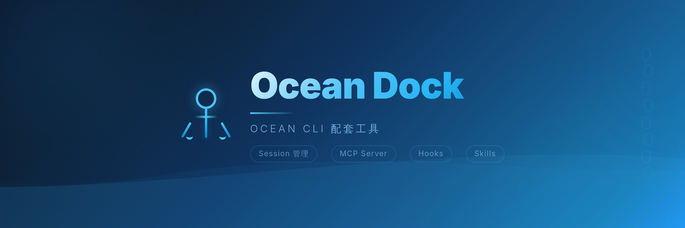

<p align="center">
  
</p>

<p align="center">
  <strong>Ocean Dock</strong> — Session Manager & MCP Server for Claude Code
</p>

<p align="center">
  <em>Claude Code / Ocean CLI 的配套工具箱 — 会话管理 · MCP Server · Hooks · Skills</em>
</p>

<p align="center">
  <a href="#quick-start">Quick Start</a> ·
  <a href="#features">Features</a> ·
  <a href="#commands">Commands</a> ·
  <a href="#architecture">Architecture</a> ·
  <a href="#configuration">Configuration</a>
</p>

<p align="center">
  
  
  
  
</p>

---

## Features

- **Session Management** — Browse, search, resume, and export Claude Code / Ocean CLI session history
- **MCP Server** — 12 Tools + 3 Resources + 2 Prompts, AI directly queries historical sessions
- **Hooks System** — 8 automation hooks (security guards, lint checks, handoff summaries, notifications)
- **Skills System** — 4 built-in skills (code review, daily report, project navigation, session handoff)
- **Project Templates** — Git hooks + .gitignore + one-click initialization
- **Zero-dependency API** — Pure local `~/.claude/` data reading, no API key required

## Quick Start

```bash
# Clone and install
git clone git@github.com:ArtLjn/ocean-duck.git
cd ocean-duck
pip install -e .

# One-click global setup (install dock command + register MCP Server + cleanup legacy)
dock setup

# List all projects
dock list

# View session details
dock show <session-id>

# Resume a session
dock resume <session-id>
dock resume <session-id> --fork    # fork mode

# Export session records
dock export -f md -o sessions.md
```

## Commands

| Command | Description |
|---------|-------------|
| `dock setup` | Global one-click setup (command + MCP + cleanup) |
| `dock teardown` | Remove MCP Server registration (+ `--all` to uninstall dock) |
| `dock init` | Project-level setup (MCP + Skills + Hooks + Git) |
| `dock list [PROJECT]` | List projects / expand sessions under a project |
| `dock show <ID>` | View session details (conversation timeline + file changes) |
| `dock resume <ID>` | Resume session (supports `--fork` and `--summary-only`) |
| `dock summary <ID>` | Generate handoff context summary |
| `dock export` | Export as Markdown / JSON |
| `dock serve` | Start MCP Server (stdio / SSE mode) |
| `dock config` | View or modify configuration |
| `dock switch` | Multi API Profile management |

> Short alias: `dock` = `ocean-dock`

## Architecture

```
ocean-dock/
├── src/ocean_dock/          # Main package
│   ├── cli.py               # CLI entry point
│   ├── models.py            # Data models
│   ├── session_store.py     # Session data layer
│   ├── commands/            # CLI subcommands
│   └── mcp/                 # MCP Server
│       ├── server.py        # FastMCP instance
│       ├── tools.py         # 12 Tools
│       ├── resources.py     # 3 Resources
│       └── prompts.py       # 2 Prompts
├── hooks/                   # 8 automation hook scripts
├── skills/                  # 4 Skill definitions
├── templates/               # Project templates (Git Hooks + .gitignore)
└── static/                  # Banner & assets
```

### MCP Tools (12)

| Tool | Description |
|------|-------------|
| `list_sessions` | List sessions (filter by project) |
| `show_session` | View session details |
| `get_session_summary` | Generate handoff context summary |
| `search_sessions` | Search sessions by keyword |
| `get_session_changes` | Get file changes (create/modify/read) |
| `get_session_requests` | Get user requests (deduplicated) |
| `get_session_todos` | Get TodoWrite task progress |
| `get_session_errors` | Get errors and issues |
| `get_session_decisions` | Get key decisions |
| `get_session_conversation` | Get conversation content |
| `list_projects` | List all projects |
| `git_commit` | Auto-detect changes and commit |

### Hooks (8)

| Hook | Event | Description |
|------|-------|-------------|
| `notify.sh` | Notification | macOS sound alerts |
| `session_start.sh` | SessionStart | Inject historical session summaries |
| `guard_bash.sh` | PreToolUse(Bash) | Block dangerous commands |
| `guard_write.sh` | PreToolUse(Write/Edit) | Block junk file writes |
| `auto_check.sh` | PostToolUse(Edit/Write) | Auto lint after file modification |
| `pre_compact.sh` | PreCompact | Preserve key info before compaction |
| `stop.sh` | Stop | Save handoff summary |
| `cleanup_stop.sh` | Stop | Auto cleanup junk files |

## Configuration

### Global Setup (Recommended)

```bash
dock setup
```

This command does three things automatically:

1. **Install `dock` command** — Writes to `~/.local/bin/dock`, globally available
2. **Register MCP Server** — Writes to `~/.claude.json`, auto-connects on Claude Code startup
3. **Cleanup legacy** — Removes old `clm`/`claude-mgr` commands and MCP entries

```bash
dock setup --no-mcp      # Install command only, skip MCP
dock setup --no-bin      # Register MCP only, skip command
dock setup --no-cleanup  # Skip legacy cleanup
```

### Uninstall

```bash
dock teardown           # Remove MCP Server only
dock teardown --all     # Remove MCP + uninstall dock command
```

### Project-level Setup

```bash
dock init          # Current project
dock init -s local # Local project only
```

### Manual MCP Registration

Add to `~/.claude.json` (global) or project `.claude/settings.json`:

```json
{
  "mcpServers": {
    "ocean-dock": {
      "type": "stdio",
      "command": "ocean-dock",
      "args": ["serve"]
    }
  }
}
```

If not in PATH, use absolute path:

```json
"command": "/path/to/ocean-duck/venv/bin/ocean-dock"
```

### Verify Connection

Restart Claude Code, then type `/mcp` to check if `ocean-dock` is connected. Once connected, AI can directly call 12 MCP Tools:

```
> Show me recent sessions
> Search historical conversations about "refactoring"
> Generate a handoff document from the last session
```

## Use with Ocean CLI

Ocean Dock is the companion tool for [Ocean CLI](https://github.com/ArtLjn/ocean-cc-cli), but also works standalone with vanilla Claude Code.

```
Ocean CLI (Host)                Ocean Dock (Companion)
├── Multi-model support        ├── Session Management
├── Auto Mode                  ├── MCP Server
├── Dual-layer memory          ├── Hooks Automation
├── Multi-model collaboration  ├── Skills System
├── Skill system               └── Project Templates
└── Channel IM integration
```

## Keywords

`claude-code` `mcp-server` `session-manager` `developer-tools` `cli` `hooks` `skills` `python` `anthropic` `ai-assistant` `productivity` `automation` `code-review` `developer-experience` `ocean-cli`

`会话管理` `MCP工具` `开发自动化` `Claude CLI` `AI编程助手`

## License

MIT
